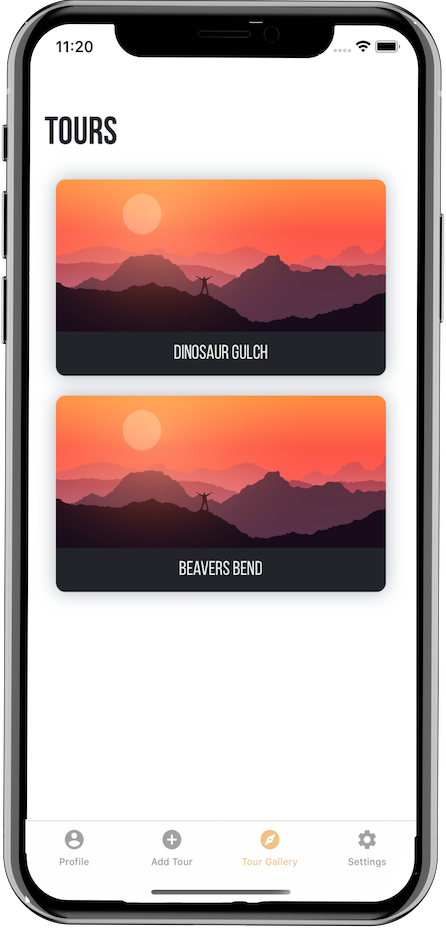
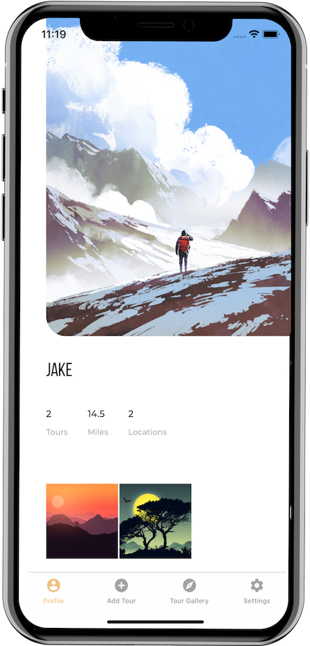

# Jake Connerly
###### Father, Husband, Nerd, Veteran, iOS Engineer, Fisherman, Fireman, Mechanic... Builder… Wait… Where was I?
 

&nbsp;&nbsp;&nbsp;&nbsp;&nbsp;&nbsp;&nbsp;&nbsp;&nbsp;

# RV Nav
RV Nav is the project I am currently working on.  It is a "Build On" application where RV users can input the dimensions of their RVs and get a route that is safe from low clearences. 

So far my largest contribution to this app is adding the ability to sign up and sign in with Google and Facebook.  The largest challenge I had to face was tying together our existing custom backend and firebase.

&nbsp;&nbsp;&nbsp;&nbsp;&nbsp;&nbsp;&nbsp;&nbsp;

# Fowl Weather
<a href="https://github.com/alexnrhodes">Fowl Weather</a> is an app that gets the current weather of your location or a location of your choice. All while giving you your daily dose of laughter from a dad joke!

I had a really good time working on this project with my partner <a href="https://github.com/alexnrhodes">Alex Rhodes</a>.  For this project I primarily handled the backend fuctionality.  I had to hit two different APIs to get the weather and the dad joke at the same time while ensuring we were thread safe.  I used <a href="https://developer.apple.com/documentation/dispatch/dispatchgroup">DispatchGroup</a> to help me achive that.  I also had a lot of fun working with <a href="https://developer.apple.com/documentation/corelocation">CoreLocation</a> and <a href="https://developer.apple.com/documentation/corelocation/clgeocoder">CLGeocoder</a> to get the users current and or searched locations.

  

# Guidr
<a href="https://github.com/bw-guidr/guidr-ios">Guidr</a> is an app for outdoor guides to keep track of their personal and professional trips!

This project my primary focus was building out the UI.  I worked closely with our team member <a href="https://github.com/marlonjames71">Marlon Raskin</a> who is a UI MONSTER!  Everytime we work together, I make sure I am "drooling" over his shoulder in efforts to absorb some of his talents.  The features I am most proud of on this one is implementing a <a href="https://developer.apple.com/documentation/uikit/uicollectionview">UICollectionView</a> and having it flow effortlessly with a <a href="https://developer.apple.com/documentation/coredata/nsfetchedresultscontroller">NSFetchedResultsController</a>.

&nbsp;&nbsp;&nbsp;&nbsp;&nbsp;&nbsp;&nbsp;&nbsp;

## Thanks for checking out my Profile!

# Contact Info:

- Email: jlconnerly@gmail.com
- LinkedIn: [jacobconnerly](https://www.linkedin.com/in/jacob-connerly/)
- Twitter: [@jakeconnerly](https://twitter.com/jakeconnerly)
